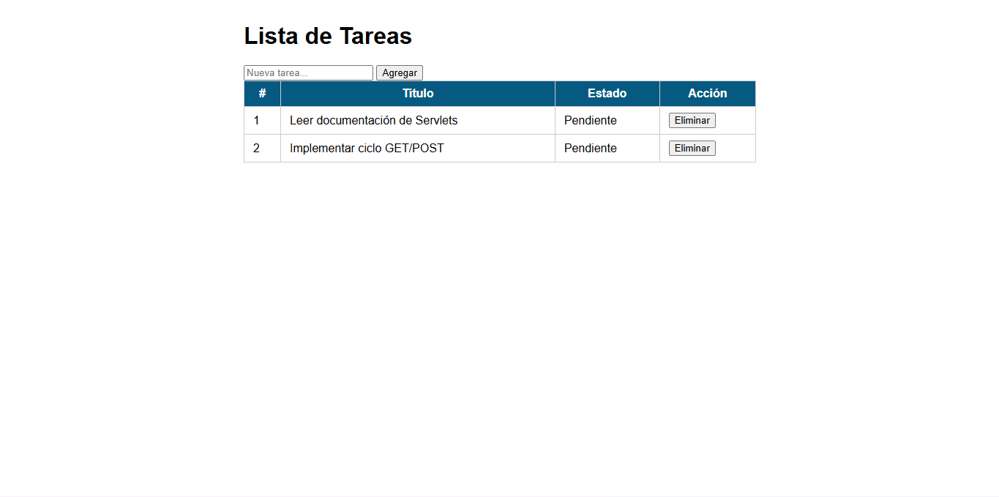
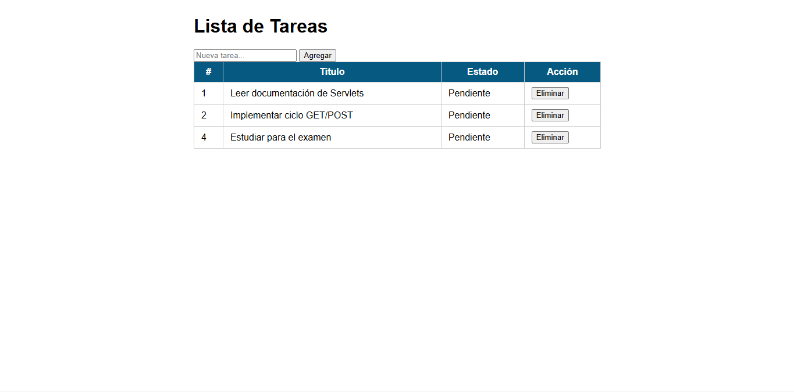
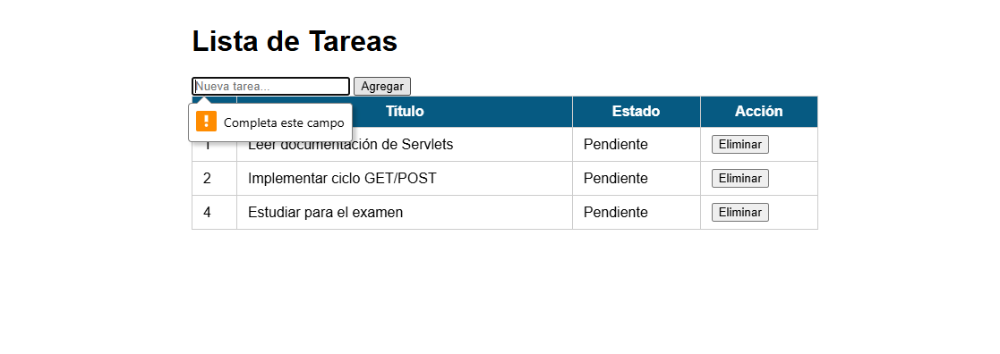
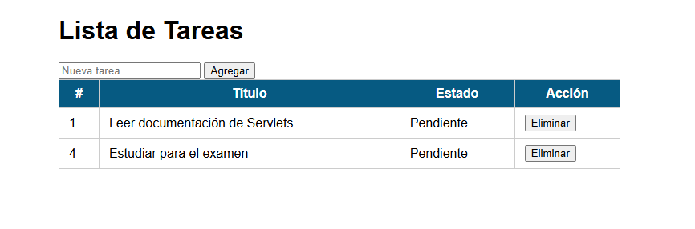

## Gestión de Tareas con Servlets 
##  Descripcion 
Aplicación web desarrollada en Java usando Servlets y JSP para gestionar tareas.

## Ejecucion 
- Clonar el repositorio
- Abrir en IntelliJ IDEA
- Configurar Apache Tomcat
- Ejecutar con Smart Tomcat
- Abrir en navegador:

## Capturas 

